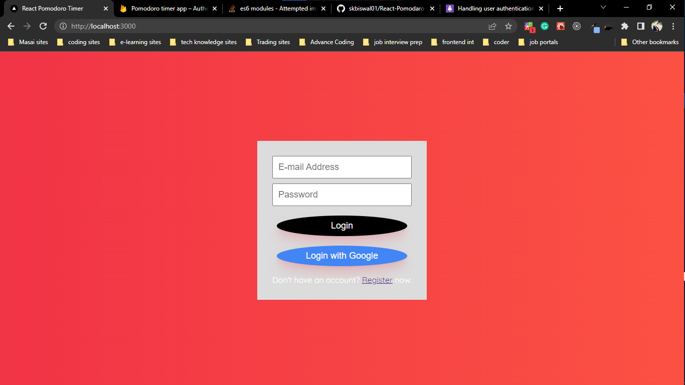
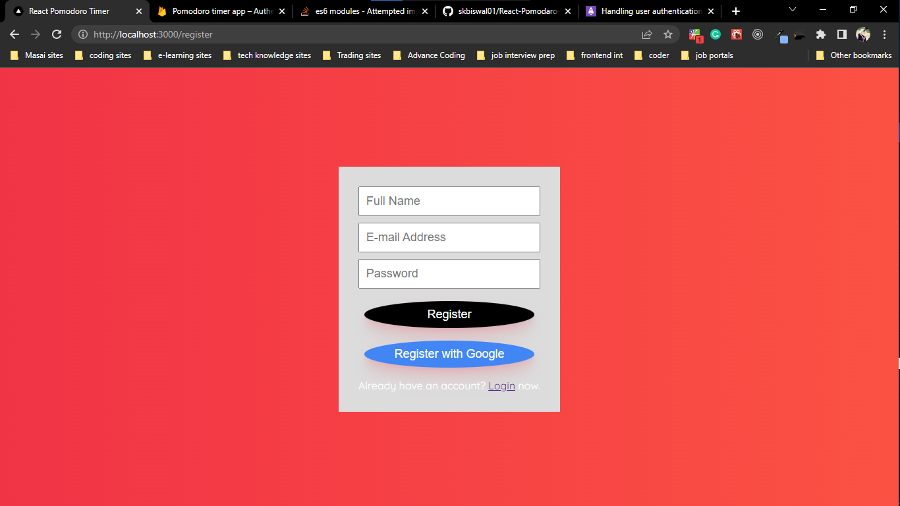
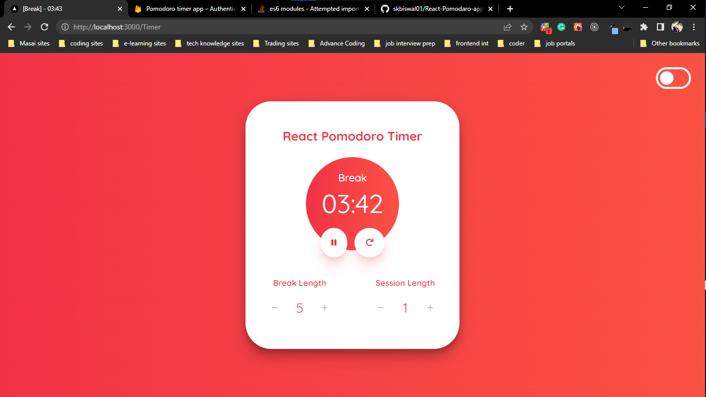
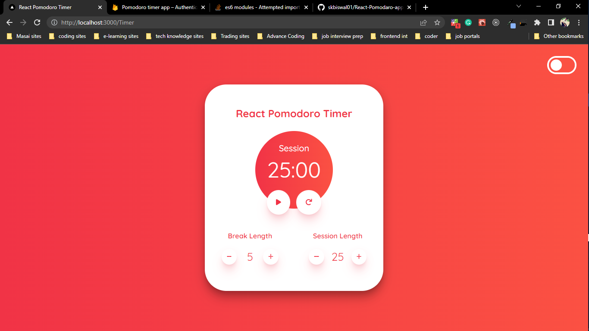
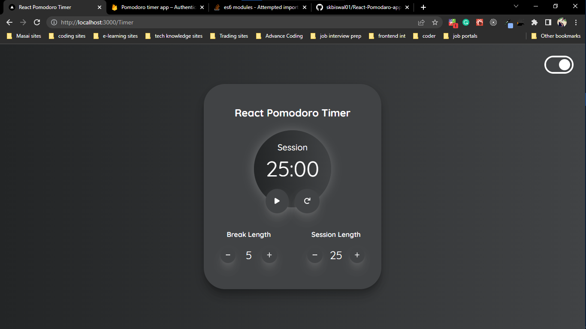

# React Pomodaro App

<h3> Tech Stack Uesd <h3>
<h4> firebase <h4>
<h4> React <h4>
<h4> Clockify library <h4>

 Note : Designing idea was taken from internet it's not my own 

 

# Preview of how my app looks on localhost
<h1>login page<h1> 

 

<h1>registration page<h1> 

 

<h1>Break period<h1> 

 

<h1>Session focus time<h1> 

 

<h1>Theme Change<h1> 

